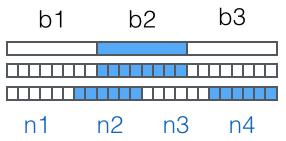

# Base64

Base64可以用来将二进制的数据编码成文本格式

#### 转换方式
1. 每三个字节作为一组，一共是24个二进制位。
1. 这24个二进制位分为四组，每个组有6个二进制位。
> 以上两点是由于一个字节8位，一个Base64字符标识为6位，最小公倍数为24（即3字节24位）
1. 每组前面加00，扩展成32个二进制位，即四个字节。
> 是因为计算机是8位8位的存数 6不够，自动就补两个高位0了?
1. 如果要编码的二进制数据不是3的倍数，最后会剩下1个或2个字节，再在编码的末尾加上1个或2个=号，表示补了多少字节
1. 据下表，得到扩展后的每个字节的对应符号，这就是Base64的编码值。

#### Base64字符集
```language
    0　A　　 17　R　　　34　i　　　51　z
    1　B　　 18　S　　　35　j　　　52　0
    2　C　　 19　T　　　36　k　　　53　1
    3　D　　 20　U　　　37　l　　　54　2
    4　E　　 21　V　　　38　m　　　55　3
    5　F　　 22　W　　　39　n　　　56　4
    6　G　　 23　X　　　40　o　　　57　5
    7　H　　 24　Y　　　41　p　　　58　6
    8　I　　 25　Z　　　42　q　　　59　7
    9　J　　 26　a　　　43　r　　　60　8
    10　K　　27　b　　　44　s　　　61　9
    11　L　　28　c　　　45　t　　　62　+
    12　M　　29　d　　　46　u　　　63　/
    13　N　　30　e　　　47　v
    14　O　　31　f　　　48　w　　　
    15　P　　32　g　　　49　x
    16　Q　　33　h　　　50　y
```

### Base64分组


### 要点
* Base64将三个字节转化成四个字节，因此Base64编码后的文本，会比原文本大出三分之一左右
* 上面可能说得不清楚，下面解释一下
  * 假设数据长度为n个字节，即有8n位
  * 转成BASE64，是第6位转成一个字符，即存在8n/6个字符
  * 一般使用ASCII编码（或者UTF8，或者其它都是1个字节？），每个字符编码后为一个字节
  * 则BASE64编码后，一共是8n/6个字节
  * (8n/6 - n) / n = n/3

### 为什么不来个BASE128和BASE256
* 因为一个字节编码的`ASCII`，只有不到85个可见字符，其它字符不能使用。例如：BEL (bell)可能会造成终端响铃。所以取64个字符(6位即2的6次方)来使用。
* Adobe创建了Base85编码来使用ASCII字符集中的更多字符，但是它受到了专利的保护。

## 引用
* [廖雪峰--Base64](http://www.liaoxuefeng.com/wiki/001374738125095c955c1e6d8bb493182103fac9270762a000/001399413803339f4bbda5c01fc479cbea98b1387390748000)
* [阮一峰--Base64笔记](http://www.ruanyifeng.com/blog/2008/06/base64.html)
* [Base64 编码](https://zhuanlan.zhihu.com/p/31264921)